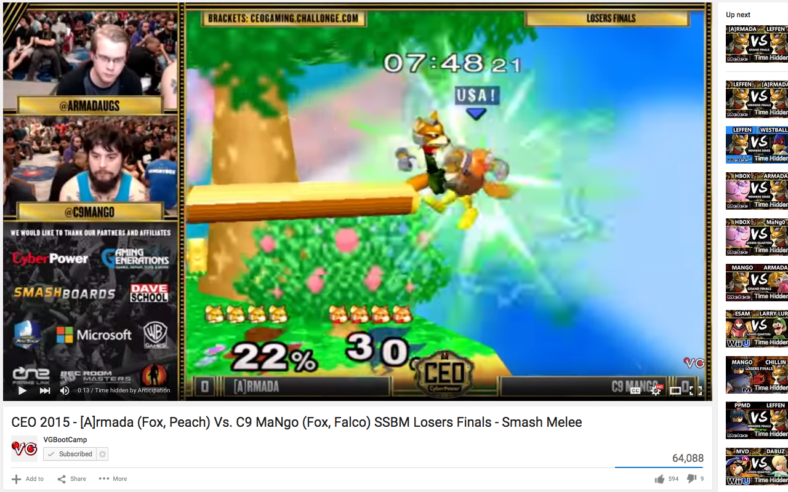

Anticipation for YouTube and Twitch
=============

Hides video time on YouTube and Twitch

Anticipation for Youtube and Twitch hides the video time and progress bar on Youtube/Twitch, along with the times of related videos on the page, so the user does not know how much time is left in a video.

Anticipation is useful when watching sports or other types of competitions when the amount of time left might give away the result of the sport, match, or competition.

## Installation

1. Download the latest release from https://github.com/krishmasand/Anticipation-Safari/releases
2. Install the downloaded extension.

Chrome Version
---------------

Can be found here: https://github.com/krishmasand/Anticipation-Chrome

Firefox Version
--------------

Can be found here: https://github.com/krishmasand/Anticipation-Firefox